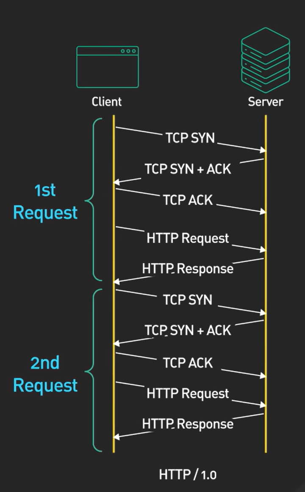
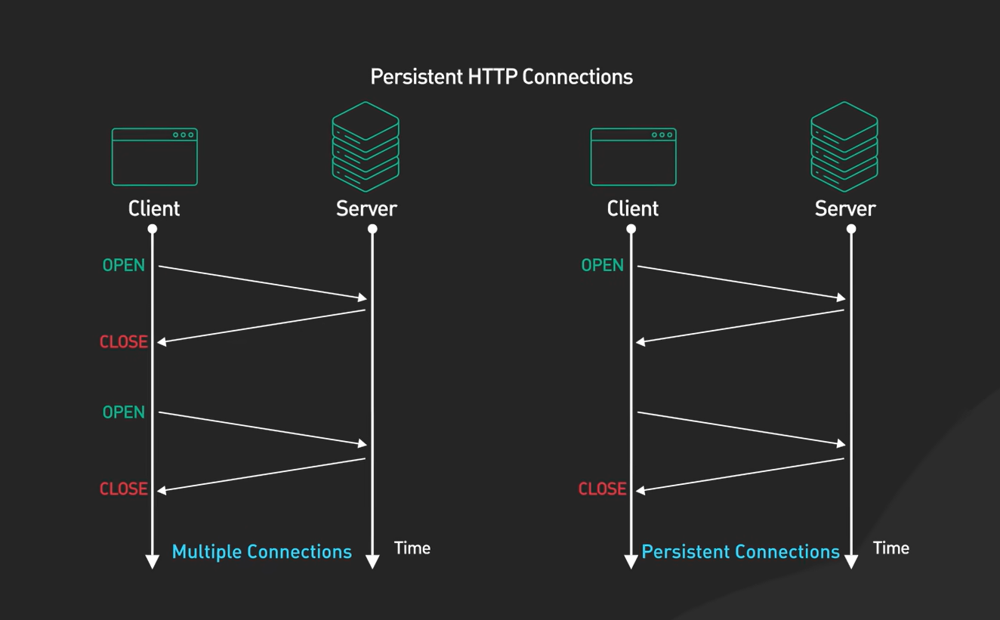

# HTTP Versions

## HTTP/0.9
-   **Simple**: No persistent connections.
-   **Stateless**: No session management.
-   **No Pipelining**: Only one request per connection.
-   Only supported GET
-   Only returned HTML
- One request → one response → connection closed
- No status codes, no headers(metadata), not scalable

## HTTP/1.0(1996)
-   **Simple**: No persistent connections.
-   **Stateless**: No session management.
-   **No Pipelining**: Only one request per connection.
- Headers introduced
- Status codes introduced
- Multiple content types introduced(HTML,images,text.)

.png)

## HTTP/1.1(1999)
-   **Persistent Connections**: Can reuse connections(One connection → multiple requests).
    
-   **Stateful**: Can maintain session state.

-   **Pipelining**: 
    .png)
    - Can send multiple requests per connection without waiting.
    - But responses must come in order.
    
    .png)
-  **Chunked transfer encoding**: Send data in pieces (streaming).
    .png)
    
- **Better caching & host support**: Host header allows multiple websites on one server
    .png)
    .png)
- If request 1 is slow → request 2 waits
    

## HTTP/2(2015)
-   **Binary Protocol**: Uses binary instead of text(faster parsing).
    
.png)
.png)

- **Header Compression**: Reduces header size.
       .png)

-   **Multiplexing**: 
    - Multiple requests & responses at the same time
    - No waiting for order
-   **Server Push**: Server can push resources to client before client requests them.
    .png)
- Single TCP connection( Efficient & Fast)
.png)

##  HTTP/3(2018)
-   **QUIC Protocol**: Uses QUIC instead of TCP, because TCP has:
    - Slow Handshake
    - Head-of-line blocking at transport level
    - QUIC uses UDP + encryption.
    .png)
    .png)
    
- **Header Compression**: Reduces header size.
- **Multiplexing**: Can send multiple requests per connection.
- Faster connection setup
- No transport-level head-of-line blocking
- Better for mobile & unstable networks
- Encryption is mandatory

.png)
.png)
    

