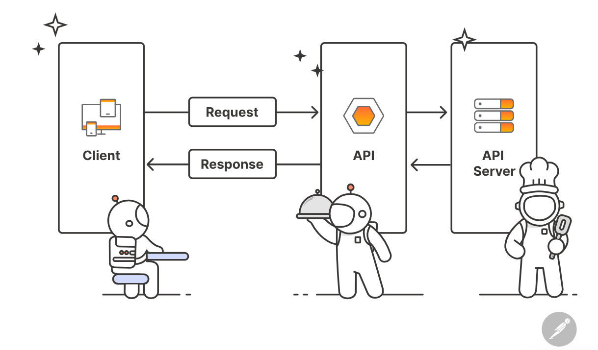
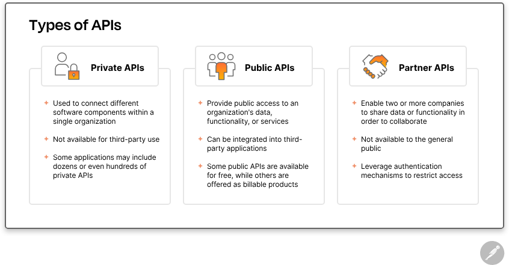

# API Introduction

An API, which stands for "Application Programming Interface", is a set of rules and protocols that enable different software components to communicate and transfer data.

# How does API work?

* APIs work by sharing data between applications, systems, and devices. This happens through a request and response cycle.

* A client sends a request to the API, then API passes this request to the server, where it is processed and the required data is retrieved. 

* The server then sends a response back through the API to the client. The client uses this response data to perform various tasks. 

* This entire process follows a client–server architecture.

  

- **API Client:** A client is a program or device that requests data from an API.

- **API Server:** A server is a program or device which is responsible for handling the authentication, validating input data, and retrieving or manipulating data.   

---

- **API Request:** An API request is a message sent by a client to an API server to retrieve or manipulate data. 

    An API request will look and behave differently depending on the type of API, but it will typically include the following components:

   - **Endpoint:** An endpoint is a dedicated URL that a client uses to access a specific resource or service provided by an API. 
   For example, an endpoint for a weather API might be https://api.weather.com/v1/current.json.

   - **HTTP Method:** An HTTP method is a request method used to specify the action the client wants to perform on a resource. Common HTTP methods include GET, POST, PUT, and DELETE.

   - **Headers:** Headers are additional information that a client sends with an API request to provide additional context or metadata about the request. 
   For example, headers might include information about the client's device, operating system, or authentication credentials.

   - **Query Parameters:** Parameters are the variables that are passed to an API endpoint to provide specific instructions for the API to process. These parameters can be included in the API request as part of the URL, in the query string, or in the request body. For example, the /articles endpoint of a blogging API might accept a “topic” parameter, which it would use to access and return articles on a specific topic.

   - **Body:** The body of an API request is the data that is sent to the API server. This data is typically used to create or update a resource. 
   For example, a POST request to a blogging API might include a JSON object in the body that contains information about a new article, such as its title, content, and author.

   ---

- **API Response:** An API response is a message sent by an API server to an API client in response to an API request. 

    An API response will look and behave differently depending on the type of API, but it will typically include the following components:

   - **Status Code:** A status code is a numeric code(3-digit) that indicates the result of an API request. Common status codes include 200 (OK), 404 (Not Found), and 500 (Internal Server Error).

   - **Headers:** Headers are additional information that a client receives with an API response to provide additional context or metadata about the response. 
   For example, headers might include information about the client's device, operating system, or authentication credentials.

   - **Body:** The body of an API response is the data that is sent to the API client. This data is typically used to create or update a resource. 
   For example, a GET request to a blogging API might include a JSON object in the body that contains information about a new article, such as its title, content, and author.

---

# Different types of API

There are many different types of APIs and ways to categorize them. For instance, you can categorize APIs by who has access to them. This organizational framework includes:

---

# Most Common API Architectural Styles

1. **REST API:** REST (Representational State Transfer) is the most popular API architectural style that uses the HTTP protocol to exchange (or transferring) data between applications over the internet. 

2. **SOAP API:** SOAP (Simple Object Access Protocol) is another popular API architectural style that uses XML to transfer  highly structured data between a client and server.  

3. **GraphQL API:** GraphQL is a query language for APIs and a runtime for executing those queries by using a type system you define for your data. It request exactly the data client need no more, no less.

4. **Webhook:** Webhook is a notification method that allows a server to send data to a client in real-time. It is a way for a server to notify a client about an event that has occurred on the server.

5. **gRPC:** gRPC is a high-performance, open-source universal RPC framework that uses HTTP/2 and Protocol Buffers to transfer data between applications.

---

# Common Use Cases  

* Integrating with internal and external systems
* Enabling real-time data exchange
* Creating more scalable systems
